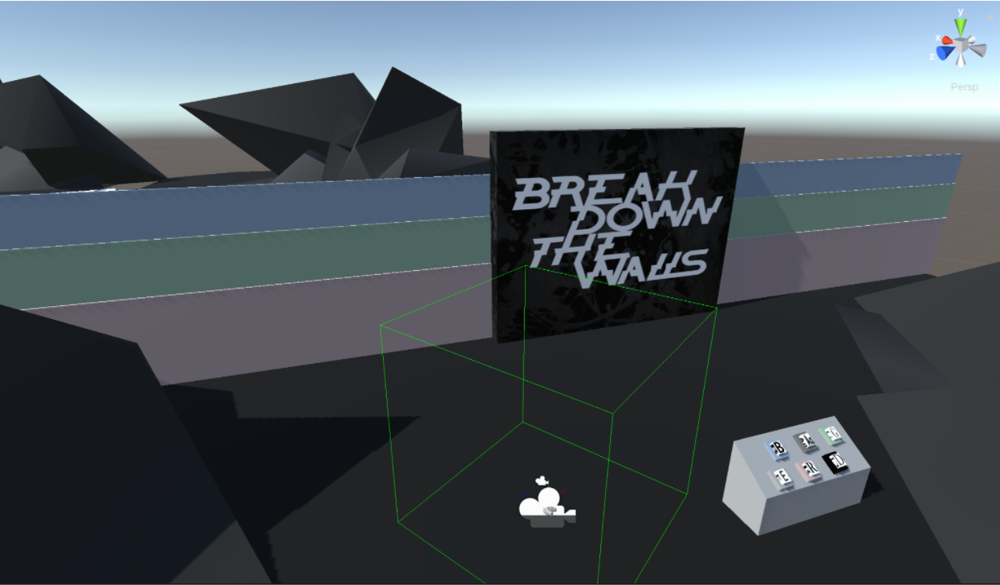
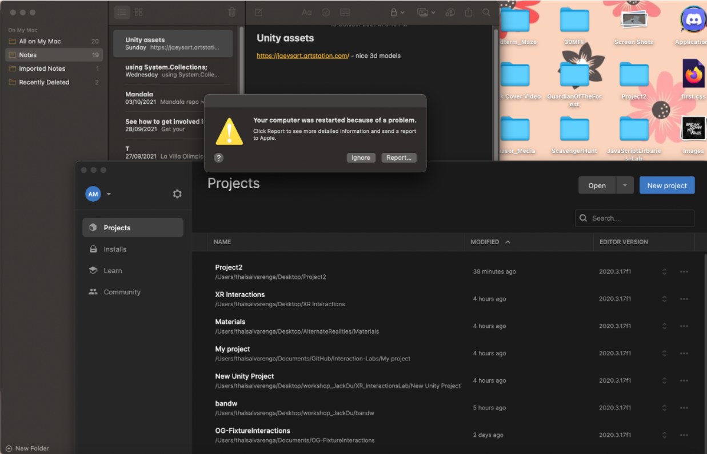

# BlackAndWhite
## Alternate Realities Project by Marta Pienkosz and Thais Alvarenga

The user is placed on a rocky platform floating in the air. Everything seems to be black and white, except for the pale colored wall and the table with magic buttons. The user has to face this and the next three challenges in order to solve the problem of color fading affecting this world. Only after passing the doors placed at the very end of the magic maze, the user will  be able to ensure that the planet happily regains all its colors.

## Progress

First, we created a standardized version of the floating platform and divided the interactions among ourselves. We decided that each of us would create a separate scene for each platform on our computer, which we would then combine into one project. To enhance the aesthetic of our project we have decided to create our own assets using the [Shapr3D Software](https://www.shapr3d.com/). We created 4 platforms with 4 different interactions in order to test out scripting abilities and how we went about creating interesting user interactions.

### Platform with wall
The platforms with the walls were pretty straightforward except for the buttons. The button script was designed for an XR Direct interactor. In the original concept, we were using the XR Ray interaction because we wanted the player to interact with a wall that would disappear once the correct sequence of buttons was entered. However, besides the fact that the buttons didn’t work the beginning because the script was for a direct interactor, once the interactor was changed to a direct one, the XR Interactors for the other platforms ended up being the XR Ray interactors, so that had to be changed again. Additionally, though having a far away button worked in terms of reflecting our original conception, the actual interaction was off since the person would have to still push in order to select the button and move it. Thus, we decided to switch from the button wall to having a series of three walls that can deactivate a panel if the user is able to identify the correct buttons for the wall. 

### Platform with balls
The second interaction revolves around grabbing and inserting the balls into the corresponding colored holes, according to the principle of complementary colors. We had some problems with adding this interaction - we didn't quite know how to access GameObjects through different scripts. As the platforms are floating in the air, we found it crucial to have an additional script that resets the ball position once it hits the y = 0 axis. In this case, when the user thoughtlessly throws the ball into space, the ball position will be reseted after some time and the user will be able to continue facing the challenge.

### Platform with cylinders
The cylinder was perhaps one of the most difficult platforms in the sense that it needed to be set well before adding the script. Placing the parent in the wrong position, for instance, would make the rotation of the cylinder weird or skewed to one side. Additionally, the turning of the dial was a bit weird with the XR Ray Interactor so the direction of the angle had to be adjusted. Connecting it with the cylinder was not that bad however, but applying the color when the dials start moving was tricky in terms of putting constraints to it.  Unfortunately, this platform had the most issues in terms of building and slowing down the computer and the camera rig sometimes acted weird (higher or lower than usual). Nonetheless, we are very happy with the big instructions placed using the letters on the cylinders. 

### Platform with maze

The platform with the maze took the longest time in terms of actually building the maze, adding the clueless for the user, making sure that the paths made sense and having the correct size so the XR camera rig would not be above the level it is supposed to be. It was tricky coming up with a way in which we could establish the trail because the New Poly Shape tool did not allow us to change the color of different sides of the material and painting it was very hard. Thus, we decided to stamp things on the walls of visual cues of what the paths were. The player should be able to see the next iteration of the letter/color of the path they are following in order to know the correct way. Additionally, we built a door and a key (the key was made in Unity and in our opinion it looks very, very pretty).

### Merging scenes together
When integrated separated platforms we wanted teleportation to play a key role. We wanted to restrict the teleportation area until the user has successfully completed a challenge. For this purpose we have placed platforms quite a distance from each other. By setting a count variable at the key moment of each interaction we have enabled a subtle move of a consequent platform. It adds an element of immersion and allows for an interesting move of a player through the created world.

We have also created our own skybox material using Adobe Photoshop!

### Adding colors to the project
Created a Color Manager for the final part of the game in which the color is brought back to the world. This required two scripts: a ColorChanger, which is applied to every object and is the one that holds the initial gray color and the final color, and a ColorManager which is applied to an empty object and controls the transition of the objects’ colors.Placing the objects on the array was tricky because if one of them did not have the correct properties, the whole array would be erased by Unity and we would have to place it again. 

The idea originally was to use these scripts to bring back color to all of the scene and have the platforms move so the user can see all of them. However, this was not as practical since in order for the player to be able to move to the last stage, the platform had to be placed with the end located on a part that does not have a view of the rest platform. Thus, we decided to create a space in the end of the maze that would colorize ince the user got out of the maze. It worked very well and the scenes (and the color transition) looked good. 

### Challenges
- Merging things.Some stuff would work when it was in its own individual scene but just crash when we placed things together. An example of this was the maze that went completely stray once we added it to the main scene. 
- Keeping track of the interactables and modifying some things designed for direct interactables so they could work with the XR ray interactable.
- Debugging is very hard, even with the mouse and keyboard XR rig simulation
- Keeping the files organized 
- Making different conditions to allow for the platform move to happen. 
- Thais’ computer died on her literally the day before this project was due. The computer had more than enough charge and storage, but it just gave up on us. 
- Having issues with the interactable script and then having to repurpose some already existing ones so they could work. 
- The computer slows down every time a script is edited. 
- The change in height of the XR rig compared to that of the simulation
- Stuff not working or working halfway but not actually doing what it is supposed to do
- Coming up with the logic for some IEnumerators and how to connect what with what 
- It is somewhat hard to understand the story only through actions rather than complimenting it with visuals. 
- So. Many. Merging. Issues. 

### Final thoughts
**What would we change?** Maybe little about the environment, having some kind of fog/ expanding into more levels/ interactions, and if possible, make it a little more story driven, perhaps that would help hint at the story of why the user has to go through all these trials. 
Adding sound could also be helpful for the user to get auditory feedback on their actions. Additionally, background noise could add to the atmosphere of the place. Another thing would be to add pop up instructions or something like that? Sort of resembling a tutorial. 
Some interactions can definitely be made more difficult by including constraints or having certain consequences for the user if they don’t do it correctly (set them back for example).

This project was very interesting and it definitely got our feet wet into scripting interactions and thinking more about the user experience and how to modify our view in order to find a balance between our initial idea and a more intuitive design.
